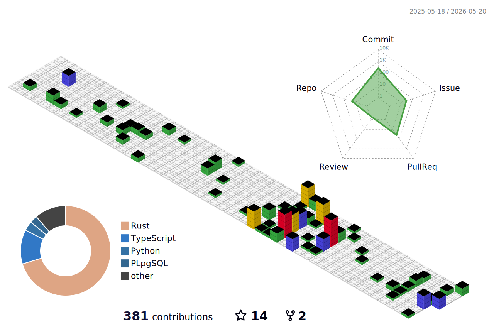

<h1 align="center">
  
</h1>
 
<!-- 徽章start -->

  <!-- Github徽章 -->
  
  <!-- Gitee徽章 -->
  <!--  -->
  <!-- 个人网站徽章 -->
  <!--  -->

<!-- 徽章end -->
 
<!--技能start-->

  
  
  
  
  
  
  
  
  
  
  
  
  
  
  
  
  
  
  

<!--技能结束-->
 

---
个人项目 - Personal Projects
- [⭐U2Secure](https://github.com/cherish-ltt/U2Secure): Linux 服务器安全加固 CLI 工具(Make your Linux system more secure through interactive CLI)
- [⭐Kcp-ovo](https://github.com/cherish-ltt/kcp-ovo): KCP协议的纯Rust实现 - 快速可靠的ARQ协议(Pure Rust Implementation of the KCP Protocol - A Fast and Reliable ARQ Protocol)
- [⭐AxumServiceScaffold](https://github.com/cherish-ltt/AxumServiceScaffold): 面向 axum + sea-orm 的 Rust 空白脚手架，采用DDD+洋葱架构(A Rust skeleton for axum + sea-orm, adopting a onion architecture)
- [⭐LynnTcp](https://github.com/cherish-ltt/lynn_tcp): 一个轻量级的 TCP 服务器框架(A lightweight TCP server framework)
- [⭐pi-dev-workflow](https://github.com/cherish-ltt/pi-dev-workflow): pi-dev-workflow(pi-dev-workflow: Developer workflow toolkit for pi: git agents, code review, Karpathy guidelines, themes  )
- [Guardian](https://github.com/cherish-ltt/Guardian): 基于 Rust-Axum 的后台管理认证系统(Backend management authentication system based on Rust-Axum)
- [Guardian-Website](https://github.com/cherish-ltt/Guardian-Website): 使用 nextjs 构建的 Guardian 认证系统前端项目(Frontend project for the Guardian authentication system built with Nextjs)
- [LynnSundial](https://github.com/cherish-ltt/lynn_sundial): 一个支持cron的异步并发定时任务管理器(An asynchronous concurrent scheduled task manager that supports cron)
- ~~[AeroX - not available](https://github.com/cherish-ltt/AeroX): 实验性高性能游戏服务器后端框架(Experimental High-Performance Game Server Backend Framework)~~
---
正在参与 - Participating
- ⭐基于kcp加速的ssh转发工具 - rksh(rust-kcp-secure-ssh)
- ⭐基于hy-mt-1.5的多平台多终端离线翻译助手

<!-- 

  
  
  
  
  
  

 -->

### My Web

| blog                                    |                      home                       |                                     Guardian                |
| -------------------------------------- | ------------------------------------------------------------ | ------------------------------------------------------------ | 
| [click](https://blog.65432123.xyz) | [click](https://www.25131425.xyz) | [click](https://guardian.25131425.xyz) |

---

  Built with ❤️ by cherish-ltt(ghyper9023) 

<!--
**cherish-ltt/cherish-ltt** is a ✨ _special_ ✨ repository because its `README.md` (this file) appears on your GitHub profile.

Here are some ideas to get you started:

- 🔭 I’m currently working on ...
- 🌱 I’m currently learning ...
- 👯 I’m looking to collaborate on ...
- 🤔 I’m looking for help with ...
- 💬 Ask me about ...
- 📫 How to reach me: ...
- 😄 Pronouns: ...
- ⚡ Fun fact: ...
- 
-->

